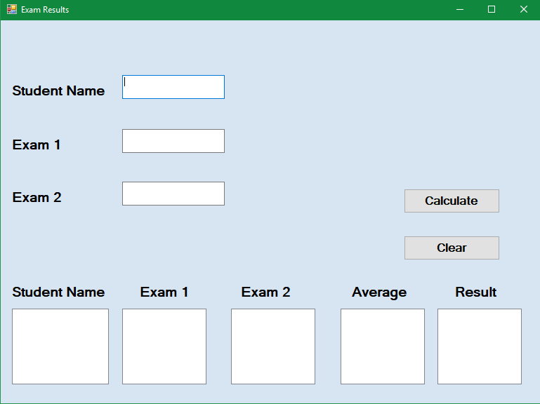
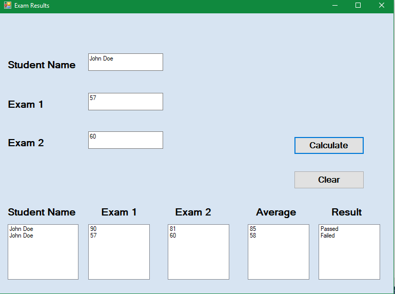

# ExamAverageApp
A simple App to calculate a student's test average.

The teacher enters the students name and the results of the exams.

Once the information is entered the app calculates the average and says if the student passed or failed.

